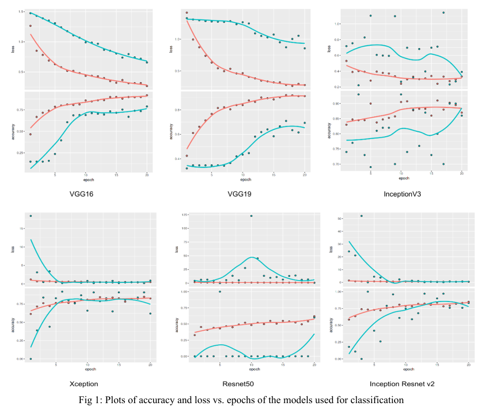
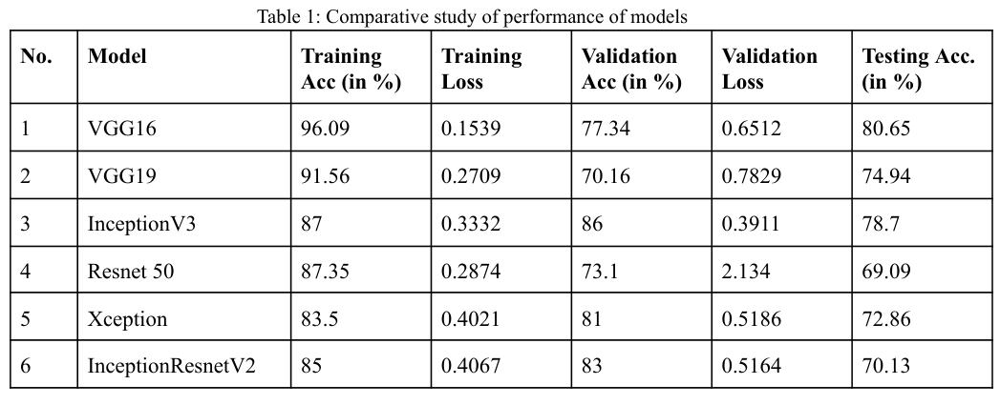

# Brain Tumor Classification
**Brain Tumor Classification using Deep Learning on MRI Scans**

Brain tumors are one of the most often diagnosed malignant tumors in persons of all ages. Recognizing its grade is challenging for radiologists in health monitoring and automated determination. It is critical to detect and classify contaminated tumor locations using Magnetic Resonance Imaging (MRI) images. Detecting the type of tumor and preventing it is one of the most challenging aspects of brain tumor categorization. With the rapid development of deep learning technology, automatic classification of brain tumors by magnetic resonance imaging (MRI) has become a promising research area.

In this project, multiclass brain tumor classification was performed using Convolutional Neural Networks on a diversified dataset of around 3264 MR images of different types of brain tumors (2870 images of training sets and 394 images of testing sets), which are classified into glioma, meningioma, pituitary and benign tumor. At the end of this project, our project will be able to classify these different types of tumors with satisfiable accuracy given a MRI image set.

In this project, six Convolutional Neural Networks were used:
1. Visual Geometry Group 16 (VGG16)
2. VGG19
3. InceptionV3
4. Xception
5. Resnet50
6. InceptionResnetV2

## Results
The following results were obtained after running the model on our test data:

## Instructions to run
1. These notebooks contain R code.
2. Upload these notebooks to Kaggle.
3. Add the [Brain Tumor MRI](https://www.kaggle.com/datasets/sartajbhuvaji/brain-tumor-classification-mri) images and the [Keras pretrained models](https://www.kaggle.com/datasets/gaborfodor/keras-pretrained-models) to the data in the right column.
4. Turn on any GPU processor. The code will crash without it due to heavy data processing.
5. Run the notebook to get the results.
